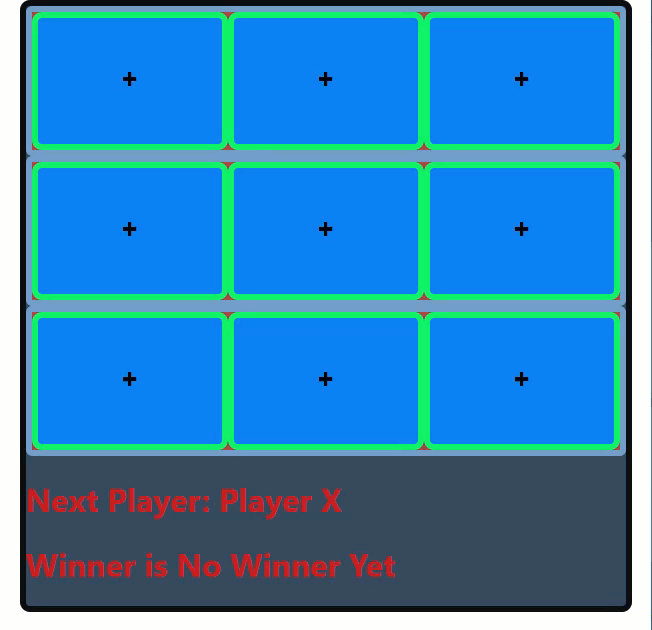

# Tic-Tac-Toe Game

> Version 1.0.0.1

A simple but rather classic Tic-Tac-Toe game project powered by React

What is being **used** in this project:
- React's **useState** hook to track multiple game variables
- React's **Component** features to model each of the game's parts

## How to use

1. The game will set the player's turns automatically.
2. Click on the **Square** on which you want your mark on.
3. The app will detect **automatically** which player won.

## Roadmap of future improvements

A player can click on a square changing the mark even if it was marked, a **lock** on marked squares fix will come.

## Maintainers
Who worked on this:
- [Simon Capriles](https://simoncapriles.github.io/)

## Support

Found some issues?  
Write to this email: <a href="mailto:info@kyohei.com.bo"><i class="font-icon icon-envelope"></i>info@kyohei.com.bo</a>

## Github

Want to download or fork the project?  
Find it on Github: [submit-form](https://github.com/SimonCapriles/submit-form)